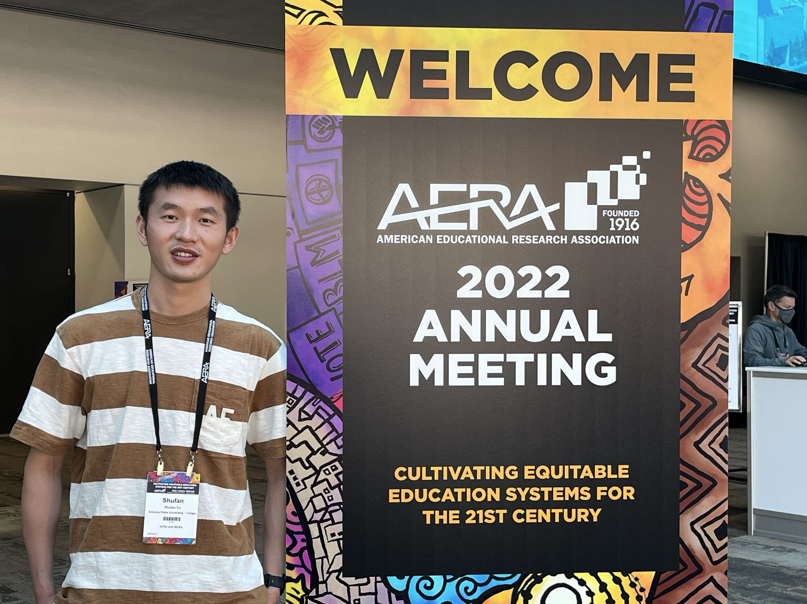

# About Me

I am a Ph.D. candidate in **Educational technology** at the School of Educational Information Technology, Central China Normal University. My research interet includes Augmened Reality（AR）/Virtual Reality (VR) based learning, Embodied cognition, and Game based learning. 

If you are interested in any aspect of me, I would love to chat and collaborate, please email me at  *[yushufan1993@gmail.com](mailto:yushufan1993@gmail.com)*

 

## Academic Background

**[Highlight] I am looking for Post Doctoral fellow Position or Assitant professor to start in 2024 Spring. Contact me if you have any leads!**

- **June 2019 - Dec 2023:** Central China Normal University (Ph.D. in Educational Technology). Advisor: Dr. Qingtang Liu
- **Nov 2021 - Dec 2022:** Arizona State University (Visting Scholar at [Embodied Games lab](https://www.embodied-games.com/games/natural-selection-catch-a-mimic/)). Advisor: Dr. [Mina C. Johnson-Glenberg](https://search.asu.edu/profile/1154172)
- **Sep 2016 - June 2019:** Central China Normal University (M.S. in Educational Technology).Advisor: Dr. Qingtang Liu
- **Sep 2012 - June 2016:** Yancheng Teachers University (B.E. in Digital Media Technology)

-

 

---

## Research Interests

- AR/VR based instruction
- Embodied Cognition
- Technology Enhanced learning

My current research focuses on an AR-based Circuit experiment in jornal high school. 
 

---

## News and Updates

- **Sep 2023：**
- **Aug 2023：**
- **May 2023：**
- **May 2023：**
- **Jan 2023：**
- **Jun 2022：**

 
